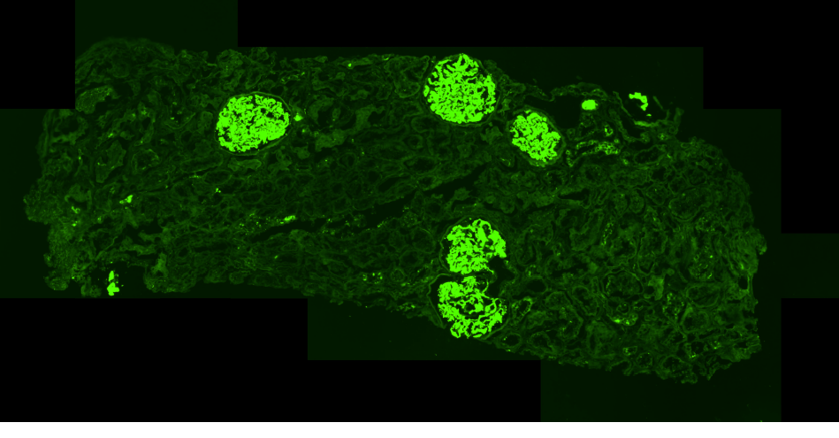
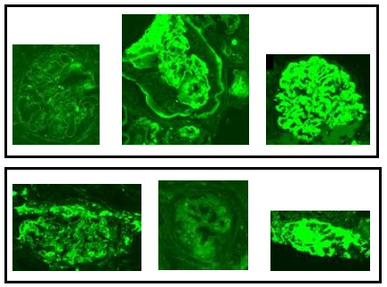

# DGDI

DGDI: A Dataset for Detecting Glomeruli on Renal Direct Immunofluorescence

To advance the automatic renal disease diagnosis, we introduce a new benchmark dataset for Detecting Glomeruli on renal Direct Immunofluorescence (DGDI). To build the baselines, we investigate various CNN-based detectors on DGDI. Experiments demonstrate that DGDI well represents the challenges of renal direct immunofluorescence image analysis and encourages the progress in developing new approaches for understanding renal disease. 

Renal slide obtained through automated scanning system. 
   
Glomerulus variability; The glomeruli are different in terms of size, image intensity and shape due to various patient conditions, antibody types and scan quality.

# Dataset Information:

The preparations of renal Direct Immunofluorescence (DIF) slides are undertaken for use with microscopes in a dark room at the Sullivan Nicolaides Pathology, Australia. The renal slides prepared with DIF are generally separated into 8 groups, each stained with a different antibody. These antibodies are as follows: IgG, IgA, IgM, C3, Fib, C1q, Kappa, and Lambda. The specificity and range of diagnoses possible greatly benefits from slide preparation with the given variety, with each antibody binding to an assortment of proteins, and yielding different illumination intensities when examined under a dark field microscope.  All the patient data had been de-identified prior releasing the dataset.
# Current Description (August 2018) 

The dataset we created in the experiments includes 273 WSI prepared from 48 patients. Each WSI image was 12 times downsized and then manually labeled. The bounding boxes were required to capture the entire glomerulus region, with minimal interference of the surrounding structure. The annotation work was conducted by well-trained pathological image researchers. Annotations are provided in a .txt file with bounding boxes information formatted as (x_min, y_min, width, height). 

# License

The DGDI Dataset and associated data ('Licensed Material') are made available to the scientific community for non-commercial research purposes such as academic research, teaching, scientific publications or personal experimentation. The DGDI dataset (‘Licensed Material’) are made available to the non-commercial and scientific communities for academic, teaching and scientific purposes. Permission is granted to you (‘the Licensee’) to use the dataset with these conditions. Please include a reference to the following published work:
               DGDI: A Dataset for Detecting Glomeruli on Renal Direct Immunofluorescence
                K. Zhao, Y. J. J. Tang, T. Zhang, J. Carvajal, D. F. Smith. A. Wiliem, P. Hobson, A. Jennings and B. C. Lovell
                Digital Image Computing: Techniques and Applications 2018.

# Download

The current version of the DGDI Dataset [download](https://outbox.eait.uq.edu.au/uqkzhao1/RenalDataset/DGDIdatase/UQSNPRenal_dataset.7z)

# Citation

 K. Zhao, Y. J. J. Tang, T. Zhang, J. Carvajal, D. F. Smith, A. Wiliem, P. Hobson, A. Jennings and B. Lovell "DGDI: A Dataset for Detecting Glomeruli on Renal Direct Immunofluorescence".  Digital Image Computing: Techniques and Applications, 2018.
